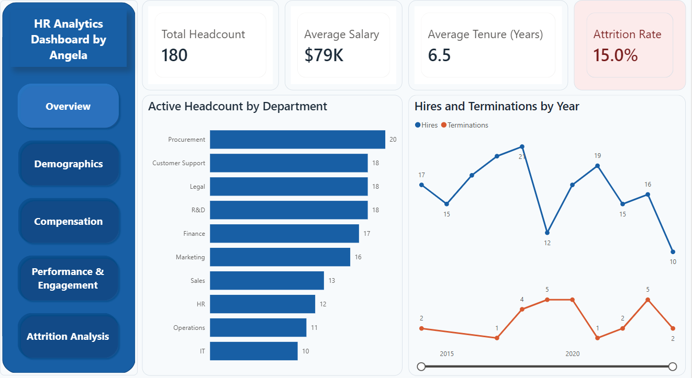

# HR Analytics Dashboard

A five-page interactive Power BI report built from a deliberately messy HR dataset, covering headcount, compensation, performance and attrition.

## What I did
- **Cleaned the data in Power Query:** removed duplicates, trimmed whitespace, standardised department names, parsed dates in several formats with a reusable M function, handled nulls case by case, corrected salary anomalies, and added calculated columns (age, tenure, employment status, age band, tenure band).
- **Modelled the data:** built a calendar table marked as the date table, with an active relationship to hire date and an inactive one to termination date, activated in DAX with USERELATIONSHIP.
- **Wrote DAX measures:** headcount (total, active, terminated), attrition rate, average and median salary, average tenure, performance rating, engagement score, hires and terminations.
- **Designed the report:** five pages (Overview, Demographics, Compensation, Performance and Engagement, Attrition Analysis) with sidebar navigation and a custom theme.

## Headline numbers
180 employees, $79K average salary, 6.5 years average tenure, 15.0% attrition rate.

## Files
- `HR_Dashboard.pbix`: the Power BI report
- `HR_Dashboard.pdf`: PDF export of the report
- `HR_Dashboard_Theme.json`: custom theme
- The dataset and a data quality write-up

## Tools
Power BI Desktop, Power Query (M), DAX, Excel

Built by Angela Iseriehen.
